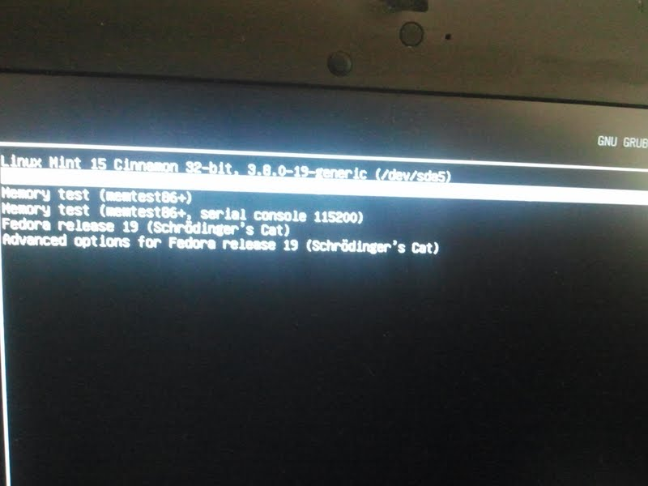

#Open Source

Hér á að koma listi af hópmeðlimum (sjá Markdown leiðbeiningar um það hvernig búa á til lista).

1. Ólafur Torfason 
2. Gústav H Gústavsson

## 1. Linux uppsetning

>Lýsið hvernig gekk að setja upp Linux (Ubuntu eða aðra útgáfu). Bætið inn í þetta skjal ljósmynd af tölvunni að ræsa Linux (skoðið hvernig myndir eru settar inn í Markdown skjöl).

+ ÓT:   
Setti upp Virtual box, og eftir margar árangurslausar tilraunir, tóks mér að setja upp Ubuntu 12.04 

+ GHG:   
LinuxMint var sett upp frá geisladiski og default partitioning valinn sem og default packa safn. (Framkvaemt i agust til ad fordast ubuntu)

## 2. Uppsetning á vim && git

>Lýsið hvernig gekk að setja upp þessi tól.

+ ÓT:   

+ GHG:    
Vim var thegar komid i notkun en hin tolin duttu inn eins og ekkert vaeri. :)

## 3. Unnið með Git (1. hluti)

>Lýsið hvernig gekk að forka NIM verkefnið, og hvernig gekk að láta hópmeðlimi gera hver sína breytingu á kóðanum.

>Látið fylgja tengil á ykkar útgáfu af verkefninu (Það á að sjálfsögðu að vera hægt að smella á tengilinn og fara þá beint í verkefnið ykkar!)

+ ÓT:   

+ GHG:   
Það er alls ekki augljóst hvernig svona tól er notað á command línu en eftir æfingu venst það. Eina leiðin er að æfa sig og venja sig á að nota þetta. Þetta fyrirkomulag bíður uppá endalausa möguleika í scripum sem geta einfaldað lífið td. þegar verið er að vinna í mismunandi projectum á sama tíma.

[INTOPrufa on github gustavhjortur](https://github.com/gustavhjortur/INTOPrufa.git "Github projectid okkar")

## 4. Uppsettur hugbúnaður

>Hér á að koma listi yfir opinn hugbúnað sem þið eruð með á vélunum nú þegar (sjá verkefnislýsingu).

+ ÓT:   

+ GHG:   
GIMP - GNU Image Manipulation Program: Released under the LGPLv3 and later versions and the GPLv3 and later versions as free and open-source software. (http://en.wikipedia.org/wiki/GIMP)   
ftp://ftp.mirrorservice.org/sites/ftp.gimp.org/pub/gimp/   
vim - Vi IMproved: Its license is GPL-compatible (http://vimdoc.sourceforge.net/htmldoc/uganda.html#license)   
ftp://ftp.vim.org/pub/vim/unix/vim-6.4.tar.bz2   
bash - GNU Bourne-Again SHell: GNU General Public License (http://www.gnu.org/licenses/gpl.html)   
http://ftp.gnu.org/gnu/bash/

## 5. Unnið með Git (2. hluti)

>Hér þarf ekkert að gera annað en að setja niðurstöður úr 4. fyrstu liðunum inn í þetta skjal.

+ ÓT:   

+ GHG:   

